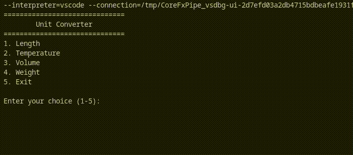

<h1 align="center">
  .NET Unit Converter Console App
</h1>

An efficient unit converter with a console interface, built using .NET and C#. This application converts length, tempearture, volume, and weight between metric and imperial.  
You can test the console application at <a href="https://dotnetfiddle.net/CsTjUv">https://dotnetfiddle.net/CsTjUv</a> or by clicking the image below.

&nbsp;

